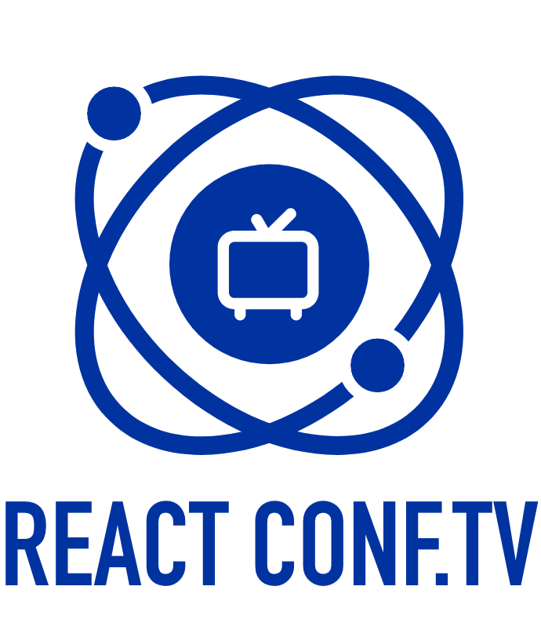
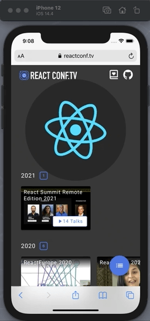

<p align="center">
  
</p>

`ReactConf.TV` is a place where passionate React developers are able to search & watch organized and up-to-date react conference videos. [Check it out](https://reactconf.tv)!

<p align="center">
  
</p>

<h2 align="center">Browse & Watch!</h2>

## Outline

- [Data Source](#data-source)<br />

- [Getting Started](#getting-started)<br/>

- [Contribute](#contribute)<br/>

- [Directory Structure](#directory-structure)<br/>

- [Contributors](#contributors)<br/>

## Data Sourcing

The data for `ReactConf.TV` mainly comes from two `YouTube Data API`:

- `playlists` API to fetch all playlists a `YouTube channel` contains
  - a `channel` normally represent the organization for a particular conference. For example, `React Europe`.
  - a `playlist` is a particular conference event, for example, `React Europe 2020`.
- `playlistitems` API to fetch all videos a `playlist` contains
  - a `video` in a `playlist` represents a talk in one conference, for example, `vjeux's talk about Excalidraw in React Europe 2020`

The high-level data sourcing logic looks like this:

1. Maintain a manual file `data/ytChannels.json`, to collect the YouTube Channels contain React Conference playlist. The ultimate source comes from [ReactJS's community conference](https://reactjs.org/community/conferences.html)
2. For every `channel` in `ytChannels`, fetch their `playlists` and save to `data/playlist/<channel-name>.json`
3. For every `playlist` in one particular `channel`, fetch the video list save to `static/playlistitems/<playlist-id>.json`
4. During build-time, the `data/playlist` will be used, so ReactConf.TV knows all conference events.
5. During runtime, when user navigate to a particular conference event, we can then fire a request to `/static/playlistitems/<playlist-id>.json` using its id, since we deploy those data as static content.

## Getting Started

```
npm install
npm start
```

open [http://localhost:8000/](http://localhost:8000/) for running locally reactconf-tv

## Contribute

Welcome to contribute!
If you have any idea or suggestion, feel free to open an issue or create a PR.

#### How To Contribute a New Conference Resource for Reactconf-tv

- Can see the file `data.json` in `data` folder , and then you would see below data structure

```
  "ytChannels": [
    {
      "name": "react-conf",
      "display": "React Conf",
      "channelId": "UCz5vTaEhvh7dOHEyd1efcaQ",
      "conferences": [
        {
          "name": "react-conf",
          "display": "React Conf",
          "filters": ["React Conf"]
        }
      ]
    }
  ]
```

- ytChannels

  - `name` Channel Name
  - `display` Unused for now
  - `channelId` Channel id which use to fetch youtube api
    - conferences
      - `name` The name of the playlist
      - `display` The playlist name will display on the reactconf-tv playlist
      - `filters` The keyword to get the playlist

- How to get the channel id ?

  - Select the channel which you want to append to reactconf-tv,<br/>
    you would see the channel id on the url.

    `https://www.youtube.com/channel/${channel_id}`

- Where the keyword which I would place in the filters array ?

  - See the below picture , you will see the two playlists,<br/>
    what they have in common is the keyword `React Conf`,<br/>
    so if you want to append these palylists,<br/>
    please concat the `React Conf` in the filters of the channel.<br/>

    - p.s. Because system limitations, please choose the playlist that postfix has particular year.

  

- Why I concat the structure of channel, but I didn’t see the list in reactconf-tv ?

  - because reactconf-tv is static site, we will output static files we need first.<br/>
    so maybe you can run below script, you will fetch the data you want,
    then submit pull request.

    `node scripts/fetch-data.js`

- Where does the data come from?
  - after running scripts: `node scripts/fetch-data.js`<br/> According to `data/data.json` `data/playlist/` and `static/playlistitems/` will be generated by the api provided from [Youtube](https://developers.google.com/youtube/v3/getting-started)
  - `data/playlist` repr a list of playlist and `static/playlistitems/` repr the detail of every video in a playlist
  - To avoid large bundle size at the first request, we will fetch only `data/playlist/` at build time and consider `static/playlistitems` as assets

### step

1. Open a new issue with description.
2. Fork and clone the repo. https://github.com/revtel/reactconf-tv.git.
3. Create a new branch based off the develop branch.
4. `npm install && npm start` to run the development enviroment.
5. Make changes.
6. Make commit message with [conventional commits specification](https://www.conventionalcommits.org/en/v1.0.0/).
7. Submit a pull request, referencing any issues it addresses.
8. We will review your Pull Request as soon as possible. Thank you for your contribution ✨

## Directory Structure

The following is the hign level folder structure of reactconf-tv

```
reactconf-tv
├── CHANGELOG.md
├── LICENSE
├── README.md
├── data
│   ├── data.json
│   └── playlist
├── gatsby-browser.js
├── gatsby-config.js
├── gatsby-node.js
├── gatsby-ssr.js
├── package-lock.json
├── package.json
├── scripts
│   └── fetch-data.js
├── src
│   ├── AppContext.js
│   ├── PageContainer.js
│   ├── components
│   ├── hooks
│   ├── images
│   ├── index.css
│   ├── pages
│   ├── templates
│   └── utils
└── static
    ├── fonts
    ├── images
    └── playlistitems
```

## Contributors

<table>
  <tbody>
    <tr>
       <td align="center">
        <a href="https://github.com/whitedogg13">
          
        </a>
        <br/>
        <div>Rick Ho</div>
      </td>
      <td align="center">
        <a href="https://github.com/whitedogg13">
          
        </a>
        <br/>
        <div>Richie Hsieh</div>
      </td>
      <td align="center">
        <a href="https://github.com/whitedogg13">
          
        </a>
        <br/>
        <div>Sam Huang</div>
      </td>
    </tr>
    <tr>
       <td align="center">
        <a href="https://github.com/Mylio-chang">
          
        </a>
        <br/>
        <div>Mylio Chang</div>
      </td>
      <td align="center">
        <a href="https://github.com/Mylio-chang">
          
        </a>
        <br/>
        <div>Chien Hsiao</div>
      </td>
      <td align="center">
        <a href="https://github.com/ulayab">
          
        </a>
        <br/>
        <div>Ula Chao</div>
      </td>
      <td align="center">
        <a href="https://github.com/guychienll">
          
        </a>
        <br/>
        <div>Guy Chien</div>
      </td>
    </tr>
  </tbody>
</table>
